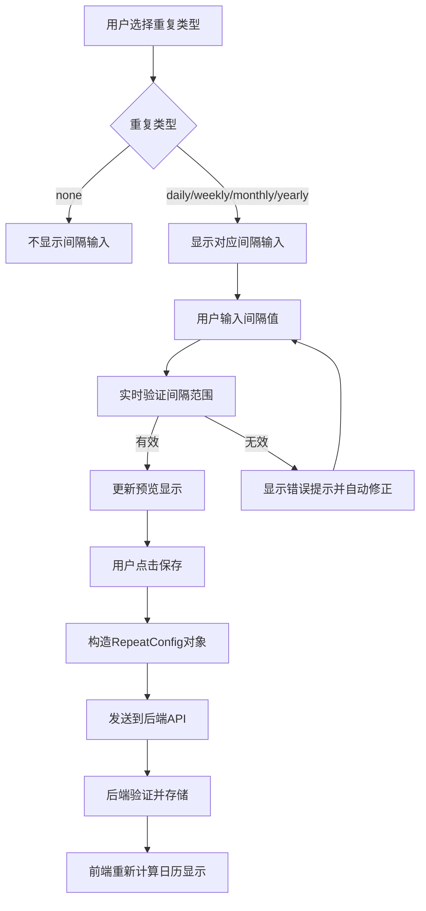

# 待办事项自定义间隔重复功能设计

## 1. 概述

当前calendar-app支持基础的重复类型（不重复、每天、每周、每月、每年），本设计旨在为所有重复类型添加自定义间隔功能，支持如每2天、每3周、每2个月、每2年等灵活的重复设置。

### 目标
- 为所有重复类型添加间隔输入框，支持自定义间隔数值
- 修改后端数据模型以存储间隔信息
- 更新重复事件计算逻辑支持所有类型的间隔
- 保持向后兼容性
- 提供直观的用户界面

## 2. 前端组件架构修改

### 2.1 用户界面设计

#### 重复选择器组件重构
原有的简单下拉选择器将被重构为带间隔输入的复合组件：

```
┌─────────────────────────────────────────────────┐
│ 重复设置                                        │
├─────────────────────────────────────────────────┤
│ □ 不重复                                        │
├─────────────────────────────────────────────────┤
│ □ 每 [输入框] 天                               │
│     ↑                                           │
│   (1-365)                                       │
├─────────────────────────────────────────────────┤
│ □ 每 [输入框] 周                               │
│     ↑                                           │
│   (1-52)                                        │
├─────────────────────────────────────────────────┤
│ □ 每 [输入框] 个月                             │
│     ↑                                           │
│   (1-12)                                        │
├─────────────────────────────────────────────────┤
│ □ 每 [输入框] 年                               │
│     ↑                                           │
│   (1-10)                                        │
└─────────────────────────────────────────────────┘
```

#### 交互设计
- 选择重复类型时自动激活对应的输入框
- 输入框显示默认值（都是1）
- 实时验证数值范围
- 支持键盘快速操作

#### 新增数据结构
```javascript
// 重复配置对象
interface RepeatConfig {
  type: 'none' | 'daily' | 'weekly' | 'monthly' | 'yearly'
  interval: number  // 所有重复类型都支持间隔，默认为1
}

// 间隔范围配置
const INTERVAL_LIMITS = {
  daily: { min: 1, max: 365, unit: '天' },
  weekly: { min: 1, max: 52, unit: '周' },
  monthly: { min: 1, max: 12, unit: '个月' },
  yearly: { min: 1, max: 10, unit: '年' }
};
```

### 2.2 组件层级修改

#### add-todo-popup.vue 组件增强
```vue
<template>
  <div class="add-todo-popup">
    <div class="popup-content">
      <h2>添加待办事项</h2>
      <input type="text" v-model="todoText" placeholder="待办事项" />
      
      <!-- 重复类型选择 -->
      <div class="repeat-section">
        <label>重复设置</label>
        
        <!-- 不重复选项 -->
        <div class="repeat-option">
          <input 
            type="radio" 
            id="repeat-none" 
            value="none" 
            v-model="repeatType"
          />
          <label for="repeat-none">不重复</label>
        </div>
        
        <!-- 每天选项 -->
        <div class="repeat-option">
          <input 
            type="radio" 
            id="repeat-daily" 
            value="daily" 
            v-model="repeatType"
          />
          <label for="repeat-daily">每</label>
          <input 
            type="number" 
            v-model.number="intervals.daily"
            :disabled="repeatType !== 'daily'"
            min="1" 
            max="365"
            class="interval-input"
          />
          <label>天</label>
        </div>
        
        <!-- 每周选项 -->
        <div class="repeat-option">
          <input 
            type="radio" 
            id="repeat-weekly" 
            value="weekly" 
            v-model="repeatType"
          />
          <label for="repeat-weekly">每</label>
          <input 
            type="number" 
            v-model.number="intervals.weekly"
            :disabled="repeatType !== 'weekly'"
            min="1" 
            max="52"
            class="interval-input"
          />
          <label>周</label>
        </div>
        
        <!-- 每月选项 -->
        <div class="repeat-option">
          <input 
            type="radio" 
            id="repeat-monthly" 
            value="monthly" 
            v-model="repeatType"
          />
          <label for="repeat-monthly">每</label>
          <input 
            type="number" 
            v-model.number="intervals.monthly"
            :disabled="repeatType !== 'monthly'"
            min="1" 
            max="12"
            class="interval-input"
          />
          <label>个月</label>
        </div>
        
        <!-- 每年选项 -->
        <div class="repeat-option">
          <input 
            type="radio" 
            id="repeat-yearly" 
            value="yearly" 
            v-model="repeatType"
          />
          <label for="repeat-yearly">每</label>
          <input 
            type="number" 
            v-model.number="intervals.yearly"
            :disabled="repeatType !== 'yearly'"
            min="1" 
            max="10"
            class="interval-input"
          />
          <label>年</label>
        </div>
      </div>
      
      <div class="button-group">
        <button @click="saveTodo" class="save-button">保存</button>
        <button @click="closeTodo" class="cancel-button">取消</button>
      </div>
    </div>
  </div>
</template>

<script setup>
import { ref, computed } from 'vue';

const props = defineProps({
  todoText: String,
  todoRepeat: String
});

const emit = defineEmits(['update:todoText', 'update:todoRepeat', 'save', 'close']);

// 重复类型
const repeatType = ref('none');

// 各类型的间隔值
const intervals = ref({
  daily: 1,
  weekly: 1,
  monthly: 1,
  yearly: 1
});

// 计算当前活跃的间隔值
const currentInterval = computed(() => {
  return repeatType.value === 'none' ? 1 : intervals.value[repeatType.value];
});

// 构造重复配置
const repeatConfig = computed(() => {
  return {
    type: repeatType.value,
    interval: currentInterval.value
  };
});
</script>
```

## 3. 数据模型修改

### 3.1 数据库Schema扩展

#### 修改todos表结构
```sql
-- 为todos表添加间隔字段
ALTER TABLE todos ADD COLUMN repeat_interval INTEGER DEFAULT 1;

-- 创建索引优化查询
CREATE INDEX IF NOT EXISTS idx_todos_repeat_type_interval 
ON todos (repeat_type, repeat_interval);
```

#### 新字段说明
- `repeat_interval`: 重复间隔值
  - 适用于所有重复类型（daily、weekly、monthly、yearly）
  - 默认值为1，确保向后兼容
  - 取值范围：
    - daily: 1-365天
    - weekly: 1-52周  
    - monthly: 1-12个月
    - yearly: 1-10年

### 3.2 兼容性处理

#### 数据迁移策略
```sql
-- 为现有数据设置默认间隔值
UPDATE todos 
SET repeat_interval = 1 
WHERE repeat_interval IS NULL;

-- 所有现有重复类型保持不变，仅添加间隔支持
-- 间隔值默认为1，保证原有行为不变
```

## 4. 核心算法设计

### 4.1 重复事件计算逻辑

#### 统一间隔计算函数
```javascript
/**
 * 计算重复事件是否应该在指定日期显示
 * @param {Date} todoDate - 原始待办事项日期
 * @param {Date} currentDate - 当前检查的日期
 * @param {string} repeatType - 重复类型
 * @param {number} interval - 间隔值
 * @returns {boolean} - 是否应该显示
 */
function shouldShowRepeatingTodo(todoDate, currentDate, repeatType, interval) {
  // 当前日期不能早于原始日期
  if (currentDate < todoDate) {
    return false;
  }
  
  switch (repeatType) {
    case 'daily':
      return shouldShowDailyInterval(todoDate, currentDate, interval);
    case 'weekly':
      return shouldShowWeeklyInterval(todoDate, currentDate, interval);
    case 'monthly':
      return shouldShowMonthlyInterval(todoDate, currentDate, interval);
    case 'yearly':
      return shouldShowYearlyInterval(todoDate, currentDate, interval);
    default:
      return false;
  }
}

/**
 * 每日间隔计算
 */
function shouldShowDailyInterval(todoDate, currentDate, interval) {
  const dayDiff = Math.floor(
    (currentDate.getTime() - todoDate.getTime()) / (1000 * 60 * 60 * 24)
  );
  return dayDiff >= 0 && dayDiff % interval === 0;
}

/**
 * 每周间隔计算
 */
function shouldShowWeeklyInterval(todoDate, currentDate, interval) {
  // 检查星期是否匹配
  if (todoDate.getDay() !== currentDate.getDay()) {
    return false;
  }
  
  const weekDiff = Math.floor(
    (currentDate.getTime() - todoDate.getTime()) / (1000 * 60 * 60 * 24 * 7)
  );
  return weekDiff >= 0 && weekDiff % interval === 0;
}

/**
 * 每月间隔计算
 */
function shouldShowMonthlyInterval(todoDate, currentDate, interval) {
  // 检查日期是否匹配（处理月末情况）
  const adjustedCurrentDate = adjustMonthEndDate(
    todoDate, 
    currentDate.getFullYear(), 
    currentDate.getMonth()
  );
  
  if (adjustedCurrentDate.getDate() !== currentDate.getDate()) {
    return false;
  }
  
  // 计算月份差
  const monthDiff = 
    (currentDate.getFullYear() - todoDate.getFullYear()) * 12 + 
    (currentDate.getMonth() - todoDate.getMonth());
  
  return monthDiff >= 0 && monthDiff % interval === 0;
}

/**
 * 每年间隔计算
 */
function shouldShowYearlyInterval(todoDate, currentDate, interval) {
  // 检查月份和日期是否匹配
  if (todoDate.getMonth() !== currentDate.getMonth() || 
      todoDate.getDate() !== currentDate.getDate()) {
    return false;
  }
  
  const yearDiff = currentDate.getFullYear() - todoDate.getFullYear();
  return yearDiff >= 0 && yearDiff % interval === 0;
}
```

#### 边界情况处理

##### 月末日期处理
```javascript
/**
 * 处理月末日期（如31号在2月不存在的情况）
 * @param {Date} originalDate - 原始日期
 * @param {number} targetYear - 目标年份
 * @param {number} targetMonth - 目标月份
 * @returns {Date} - 调整后的日期
 */
function adjustMonthEndDate(originalDate, targetYear, targetMonth) {
  const originalDay = originalDate.getDate();
  const daysInTargetMonth = new Date(targetYear, targetMonth + 1, 0).getDate();
  
  // 如果原日期大于目标月份的天数，使用目标月份的最后一天
  const adjustedDay = Math.min(originalDay, daysInTargetMonth);
  
  return new Date(targetYear, targetMonth, adjustedDay);
}
```

### 4.2 前端重复逻辑更新

#### CalendarContainer.vue getTodosForDate函数修改
```javascript
function getTodosForDate(date, dateStr) {
  const result = [];

  props.todos.forEach((todo) => {
    // 检查是否是已删除的实例
    if (isInstanceDeleted(todo.id, dateStr)) {
      return;
    }

    // 检查直接匹配的日期
    if (todo.date === dateStr) {
      const isCompleted = todo.completed || isInstanceCompleted(todo.id, dateStr);
      result.push({
        ...todo,
        isCompleted,
      });
      return;
    }

    // 检查重复的待办事项
    if (!todo.repeat_type || todo.repeat_type === 'none') return;

    const todoDate = new Date(todo.date);
    const currentDate = new Date(dateStr);
    const interval = todo.repeat_interval || 1;

    // 使用统一的间隔计算函数
    if (shouldShowRepeatingTodo(todoDate, currentDate, todo.repeat_type, interval)) {
      const isCompleted = isInstanceCompleted(todo.id, dateStr);
      result.push({
        ...todo,
        isCompleted,
      });
    }
  });

  return result;
}
```

## 5. 后端API修改

### 5.1 Worker.js API端点更新

#### 创建待办事项API修改
```javascript
async function handleCreateTodo(request, env, userId) {
  try {
    const data = await request.json();
    
    // 验证输入
    if (!data.text || !data.date) {
      return new Response(JSON.stringify({ error: "缺少必要的字段" }), {
        status: 400,
        headers: { "Content-Type": "application/json" },
      });
    }

    const repeatType = data.repeatType || "none";
    const repeatInterval = data.repeatInterval || 1;
    
    // 验证间隔值
    const validationResult = validateRepeatInterval(repeatType, repeatInterval);
    if (!validationResult.valid) {
      return new Response(JSON.stringify({ 
        error: validationResult.message 
      }), {
        status: 400,
        headers: { "Content-Type": "application/json" },
      });
    }

/**
 * 验证重复间隔值
 * @param {string} repeatType - 重复类型
 * @param {number} interval - 间隔值
 * @returns {object} - 验证结果
 */
function validateRepeatInterval(repeatType, interval) {
  const limits = {
    daily: { min: 1, max: 365, unit: '天' },
    weekly: { min: 1, max: 52, unit: '周' },
    monthly: { min: 1, max: 12, unit: '个月' },
    yearly: { min: 1, max: 10, unit: '年' }
  };
  
  if (repeatType === 'none') {
    return { valid: true };
  }
  
  const limit = limits[repeatType];
  if (!limit) {
    return { valid: false, message: '不支持的重复类型' };
  }
  
  if (interval < limit.min || interval > limit.max) {
    return { 
      valid: false, 
      message: `${repeatType}间隔必须在${limit.min}-${limit.max}${limit.unit}之间` 
    };
  }
  
  return { valid: true };
}

    // 插入待办事项
    const result = await env.DB.prepare(`
      INSERT INTO todos (text, date, repeat_type, repeat_interval, completed, user_id)
      VALUES (?, ?, ?, ?, 0, ?)
    `)
      .bind(data.text, data.date, repeatType, repeatInterval, userId)
      .run();

    // 返回结果...
  } catch (error) {
    // 错误处理...
  }
}
```

### 5.2 查询优化

#### 数据库查询优化
```sql
-- 优化重复事件查询，包含间隔信息
SELECT * FROM todos 
WHERE user_id = ? AND (
  (date BETWEEN ? AND ?) OR
  (repeat_type != 'none' AND date <= ?)
)
ORDER BY date, repeat_type, repeat_interval;
```

## 6. 用户体验增强

### 6.1 界面交互设计

#### 间隔输入验证
- 实时数字验证，不同类型有不同范围限制
- 输入提示信息：
  - 每天："1-365天"
  - 每周："1-52周"
  - 每月："1-12个月"
  - 每年："1-10年"
- 默认值：所有类型都是1（保持简单）
- 选择重复类型时自动聚焦到输入框
- 输入框失去焦点时自动校正到有效范围

#### 预览功能
```
┌─────────────────────────────────────┐
│ 重复预览                            │
├─────────────────────────────────────┤
│ 原始日期: 2024年1月15日              │
│ 重复设置: 每3周                     │
│                                     │
│ 接下来几次重复:                     │
│ • 2024年2月5日（星期一）            │
│ • 2024年2月26日（星期一）           │
│ • 2024年3月18日（星期一）           │
│ • 2024年4月8日（星期一）            │
└─────────────────────────────────────┘
```

#### 智能提示
根据不同重复类型显示相应的说明：
- **每X天**："从原始日期开始，每X天重复一次"
- **每X周**："每X周的同一天重复（如每2周的星期一）"
- **每X个月**："每X个月的同一日期重复（月末日期自动调整）"
- **每X年**："每X年的同一月同一日重复"

### 6.2 错误处理和用户引导

#### 输入验证消息
```javascript
const validationMessages = {
  daily: {
    required: "请输入天数间隔",
    range: "间隔必须在1-365天之间",
    integer: "天数必须是整数"
  },
  weekly: {
    required: "请输入周数间隔",
    range: "间隔必须在1-52周之间",
    integer: "周数必须是整数"
  },
  monthly: {
    required: "请输入月份间隔",
    range: "间隔必须在1-12个月之间",
    integer: "月份必须是整数"
  },
  yearly: {
    required: "请输入年数间隔",
    range: "间隔必须在1-10年之间",
    integer: "年数必须是整数"
  }
};
```

#### 智能默认值和用户体验
- 所有间隔类型默认值都是1，保持一致性
- 点击单选框时自动聚焦到对应输入框
- 输入框支持键盘上下键调整数值
- 超出范围时自动调整到最近的有效值
- 记住用户最近使用的间隔设置

## 7. 数据结构流转图



## 8. 测试策略

### 8.1 单元测试

#### 核心算法测试用例
```javascript
describe('shouldShowRepeatingTodo', () => {
  // 每日间隔测试
  describe('daily interval', () => {
    test('每2天重复 - 正确日期', () => {
      const todoDate = new Date('2024-01-15');
      const currentDate = new Date('2024-01-17');
      expect(shouldShowRepeatingTodo(todoDate, currentDate, 'daily', 2)).toBe(true);
    });
    
    test('每3天重复 - 错误日期', () => {
      const todoDate = new Date('2024-01-15');
      const currentDate = new Date('2024-01-17');
      expect(shouldShowRepeatingTodo(todoDate, currentDate, 'daily', 3)).toBe(false);
    });
  });
  
  // 每周间隔测试
  describe('weekly interval', () => {
    test('每2周重复 - 同一星期几', () => {
      const todoDate = new Date('2024-01-15'); // 星期一
      const currentDate = new Date('2024-01-29'); // 两周后的星期一
      expect(shouldShowRepeatingTodo(todoDate, currentDate, 'weekly', 2)).toBe(true);
    });
    
    test('每2周重复 - 不同星期几', () => {
      const todoDate = new Date('2024-01-15'); // 星期一
      const currentDate = new Date('2024-01-30'); // 星期二
      expect(shouldShowRepeatingTodo(todoDate, currentDate, 'weekly', 2)).toBe(false);
    });
  });
  
  // 每月间隔测试
  describe('monthly interval', () => {
    test('每2个月重复 - 正确日期', () => {
      const todoDate = new Date('2024-01-15');
      const currentDate = new Date('2024-03-15');
      expect(shouldShowRepeatingTodo(todoDate, currentDate, 'monthly', 2)).toBe(true);
    });
    
    test('月末日期处理', () => {
      const todoDate = new Date('2024-01-31');
      const currentDate = new Date('2024-02-29'); // 2024年闰年
      expect(shouldShowRepeatingTodo(todoDate, currentDate, 'monthly', 1)).toBe(true);
    });
  });
  
  // 每年间隔测试
  describe('yearly interval', () => {
    test('每2年重复 - 正确日期', () => {
      const todoDate = new Date('2024-01-15');
      const currentDate = new Date('2026-01-15');
      expect(shouldShowRepeatingTodo(todoDate, currentDate, 'yearly', 2)).toBe(true);
    });
  });
});
```

### 8.2 集成测试

#### 端到端测试场景
1. **每日间隔测试**：创建每3天重复的待办事项，验证显示逻辑
2. **每周间隔测试**：创建每2周重复的待办事项，验证星期匹配
3. **每月间隔测试**：创建每2个月重复的待办事项，测试月末边界情况
4. **每年间隔测试**：创建每2年重复的待办事项，验证年度重复
5. **输入验证测试**：测试各种无效输入的处理
6. **兼容性测试**：验证现有数据的正确显示
7. **完成和删除操作测试**：测试间隔重复事项的操作

## 9. 性能考虑

### 9.1 查询优化
- 添加复合索引：`(repeat_type, repeat_interval, date)`
- 限制查询范围，避免计算过远的重复事件
- 前端缓存重复计算结果

### 9.2 内存优化
- 重复事件计算结果缓存
- 避免在日历渲染时重复计算相同的重复规律

## 10. 向后兼容性

### 10.1 数据兼容
- 现有`repeat_type = 'monthly'`保持不变
- 新的间隔功能使用`repeat_type = 'monthly_interval'`
- `repeat_interval`字段默认值为1，确保兼容

### 10.2 API兼容
- 现有API接口保持不变
- `repeat_interval`字段为可选参数，默认值为1
- 老版本客户端发送的数据会自动设置interval为1
- 新客户端可以处理老数据（interval为NULL时默认为1）
- 前端组件向下兼容，能够正确显示老数据